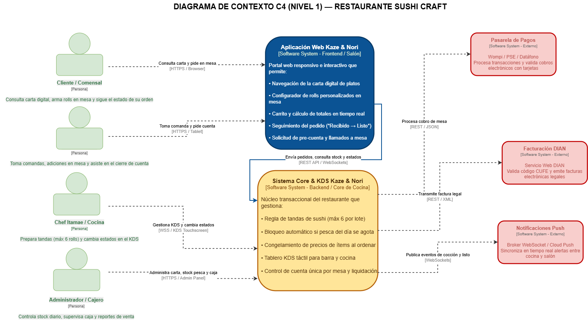

# Documento de Alcance y Definición de Contexto (Scope)
**Proyecto:** Sistema de Gestión Integral de Restaurante — *"Kaze & Nori (Sushi Craft & Izakaya)"*  
**Código del Proyecto:** DOSW-LAB3-KSR  
**Autores:** Kevin Ángel, Santiago García, Raúl Morales  

---

## 1. Información del Sistema

### 1.1 Nombre y Concepto
* **Nombre:** Sistema Web *Kaze & Nori*
* **Concepto:** Restaurante de gastronomía japonesa contemporánea con barra de sushi artesanal (rolls armados a pedido en tandas de máx 6 unidades), nigiris, sashimis y platos calientes (ramen/tempura).
* **Propósito:** Digitalizar el ciclo operativo completo: carta digital en tiempo real, personalización de rolls, control de flujo en cocina KDS, gestión de stock de pesca fresca del día y facturación por mesa.

---

## 2. Problema a Resolver

1. **Comandas manuales en papel:** Errores en la personalización de rolls (ingredientes, envolturas, salsas) y demoras de comunicación entre salón y la barra del sushichef.
2. **Falta de visibilidad de inventario crítico:** Si se agota el salmón fresco o el alga nori, los clientes siguen pidiéndolos en papel y la orden se rechaza minutos después.
3. **Descoordinación en tiempos de cocina:** No hay control de tandas de preparación en la barra ni seguimiento del estado del pedido (*RECIBIDO → EN PREPARACIÓN → LISTO → ENTREGADO*).
4. **Cuentas desarticuladas:** Dificultad para congelar precios al ordenar y control de una sola cuenta activa por mesa.

---

## 3. Diagrama de Contexto C4 (Nivel 1)

### Descripción de Relaciones:
* **Cliente / Mesero → Sistema:** Consulta de carta, armado de rolls y envío de comanda.
* **Sistema → Cocinero / Itamae:** Visualización de pedidos en pantalla táctil KDS por tandas.
* **Sistema → Pasarela de Pago:** Solicitud y confirmación de cobro.
* **Sistema → DIAN:** Envío de comprobante para facturación electrónica.

*(Aquí insertas la imagen exportada del diagrama C4):*  

---

## 4. Alcance del Sistema (Scope Definition)

### 4.1 Dentro del Alcance (In-Scope — MVP)
* **Carta digital interactiva:** Filtro por categorías y visualización de disponibilidad de insumos en tiempo real.
* **Armado de pedidos:** Personalización de rolls y validación de tandas de preparación (máx 6 por lote).
* **Tablero KDS de cocina:** Transiciones de estado (*RECIBIDO*, *EN PREPARACIÓN*, *LISTO*, *ENTREGADO*) y bloqueo de modificaciones una vez en preparación.
* **Gestión de cuenta y caja:** Congelamiento de precios al ordenar, una sola cuenta por mesa física y registro de pago.

### 4.2 Fuera del Alcance (Out-of-Scope — Fases Futuras)
* Módulo de domicilios externos con tracking GPS.
* Reservas previas de mesas con pago anticipado.
* Sistema de fidelización y puntos por cliente.
* Integración con plataformas de terceros (Rappi, UberEats).
